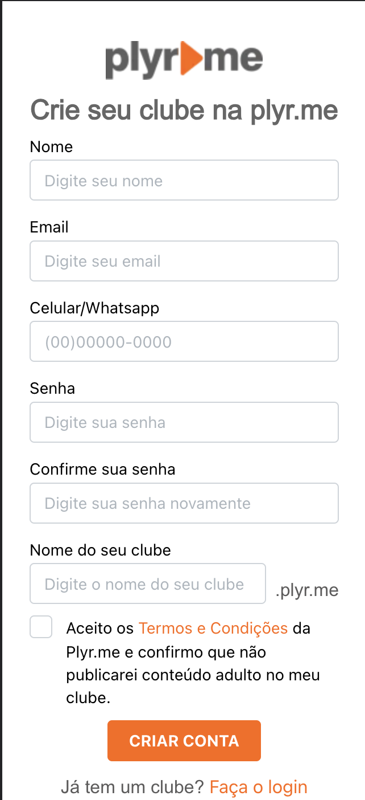

    

<h1 align='center'> Página de Cadastro de usuário</h1>

    
    
    
    
    
    

## 📌Descrição do projeto

O presente projeto trata-se de uma simples tela de cadastro de usuário sem integração com APIs.
Esse projeto visa apenas a construção da interface, e a preparação do formulário para o envio e comunicação com uma API externa.

## 📌Tecnologias Utilizadas

✔️ Next.;  
✔️ Typescript;  
✔️ Yup (validação dos formulários);  
✔️ React Hook Form (criação do formulário);  
✔️ React IMask (criação de máscaras para inputs);  
✔️ Mantine UI (Design de toda a tela);
## 📌Screenshots

### Tela padrão (desktop)

### Tela com mensagens de erro (desktop)

### Tela versão mobile (desktop)

